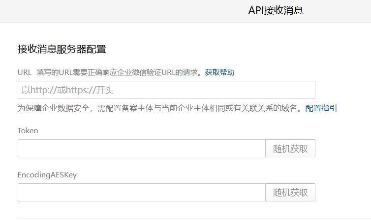

# wechat 
适用环境 >= Python 3.6

## 介绍
### 企业微信自建应用消息接收  
功能1：校验企业可信 IP 的**接收消息服务器 URL**。



功能2：消息接收，用于回调。

### 消息发送
发送消息，支持类型
+ text
+ markdown

## 软件架构
**sign** 接口用于**API 接收消息校验**。

**alarm** 接口用于发送消息。

企业微信 **access_token** 存储 Redis，有效期 **2h**。

## 安装教程
```shell
git clone https://github.com/UmfintechWtc/wechat.git
cd wechat 
pip install -r requirements.txt
```

## 配置说明
详见 **config/wechat.yaml**

## 接口说明
### API 接收消息接口 - sign
**页面配置保存时，企业微信自动请求进行校验**。

### 发送消息接口 - alarm
+ 请求方法  
    ```shell
    POST
    ```
  
+ 请求数据类型  
    ```python
    {"Content-Type": "application/json"}  
    ```

+ 请求参数说明
    
    + agentid: **require**
       - 自建应用 agentid
      
    + secret: string - **require**
      - 自建应用 secret
    
    + receiver: **require**
        - 接收人
        ```python
        {"touser": []}    # 指定接收消息的成员
        {"toparty": []}   # 指定接收消息的部门
        {"totag": []}     # 指定接收消息的标签
        ```
    + content: string
        - 告警内容
    
    + msg_type: string
        - 消息格式 
            + text **(default)**
            + markdown


## Shell 案例
### 文本消息
```shell
curl -X POST http://localhost:18889/alarm -H "Content-Type: application/json" -d '{"agentid": 1000006,"secret": "ztbhARkEN6V4HvzMGQaUd8snA7Mn6BGKxJ3cgHsqt0o","receiver": {"touser": ["TianCiwang"]},"content": "wwww"}'
```
### markdown 消息
```shell
curl -X POST http://localhost:18889/alarm -H "Content-Type: application/json" -d '{"agentid": 1000006,"secret": "ztbhARkEN6V4HvzMGQaUd8snA7Mn6BGKxJ3cgHsqt0o","receiver": {"touser": ["TianCiwang"]},"content": "您的会议室已经预定，稍后会同步到`邮箱`  \n>**事项详情**  \n>事　项：<font color=\"info\">开会</font>  \n>组织者：@miglioguan  \n>参与者：@miglioguan、@kunliu、@jamdeezhou、@kanexiong、@kisonwang  \n>  \n>会议室：<font color=\"info\">广州TIT 1楼 301</font>  \n>日　期：<font color=\"warning\">2018年5月18日</font>  \n>时　间：<font color=\"comment\">上午9:00-11:00</font>  \n>  \n>请准时参加会议。  \n>  \n>如需修改会议信息，请点击：[修改会议信息](https://github.com/UmfintechWtc/wechat)","msgtype": "markdown"}'
```